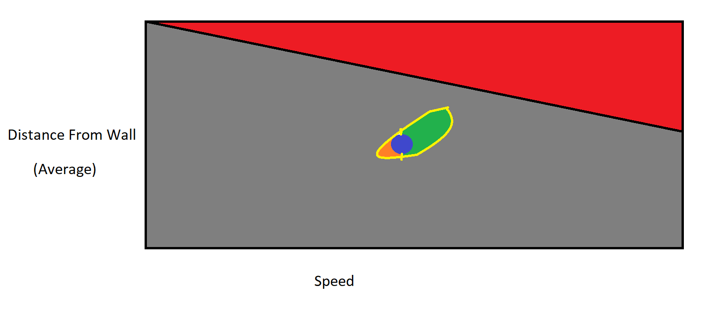
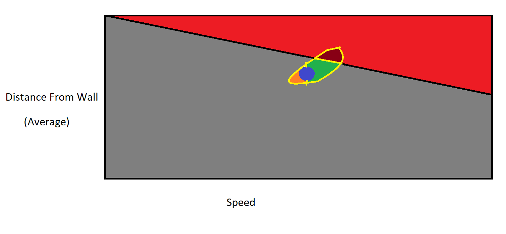
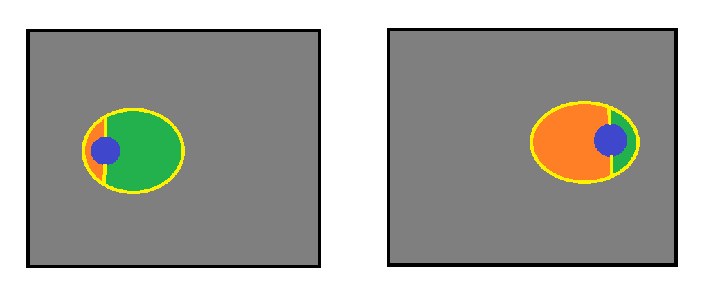

# Understanding Bruteforce Intuitively

By SaiMoen.

It is assumed the reader is roughly familiar with how bruteforce works in TMInterface
([what-is-bf](https://donadigo.com/tminterface/what-is-bf)).
It's also mostly theoretical, as the practical part can only truly be learned by doing it yourself,
or learning from how others use bruteforce in practice.

This blog is aimed more at understanding how to actually reason about what it's doing,
and why, from first principles.

## Intro

Recently, I was reading some messages in the TMInterface Discord server, when I came across the following
[message(s)](https://discord.com/channels/847108820479770686/849394911849742366/1239311260604960859)
sent by threadd (see image below).
The context is essentially that someone couldn't get a noseboost, as bruteforce simply wasn't finding anything.
So, threadd explains that you can't just throw something into bruteforce and expect that it will try to solve your problems.

[Image of messages](initial_msg.png)

I agree with the general take, so now I will try to expand on it a little more.

## The need for Bruteforce

So wait, why do we use this thing again?
Well, TMNF has a lot of possible states the car can be in.
The basic calculation shows that the car could branch out to (up to) 524292 different possible states from one tick to the next.

This is mostly because of the following:
there are 65536 steering values to the left, 0 steer exists, and then there are 65536 steering values to the right.
Ignoring gas and brake (the explanation for the extra factor of 4 in the earlier number),
this means that trying all possible permutations of steering values,
assuming a rate of 1000/s over just 4 ticks (0.04s in-game) would take about 9.353 billion years.

Since that won't be happening, the next best thing is to try stuff randomly,
and then only keep improved versions of the run we started with (the *base* run), so that the result improves over time.
Which begs the question, what do we count as an improvement?

## The goal of Bruteforce

The gut reaction of any TrackMania player would probably be to just count speed increase as an improvement.
This is actually a strategy that works in many situations, but it has some problems:
the bruteforcer can really just go anywhere and do anything to get improvements.

This highlights an intrinsic fact about bruteforce, which is that it doesn't care about your run at all.
And if a certain 'path' (not necessarily physical, I'll get to it later) is, as threadd describes it,
a 'lower energy state' compared to another, then bruteforce is more likely to take that path.
As long as it gets attempts that are 'improvements' to it, along the way.
To make it more likely to take a path you want, you must make your path the most likely one if it isn't.
In order to achieve that, you can use a bruteforce mode that applies more constraints, and/or use certain settings to do so.

For instance, triggers can help your car stay in a certain spot rather than going somewhere unintended.
Additionally, the `bf_condition_speed` variable can set a minimum speed,
that will automatically reject an attempt if it goes below that speed.

Another important aspect to this is the quality of the base run, see the following:
[Garbage In, Garbage Out](https://en.wikipedia.org/wiki/Garbage_in,_garbage_out)

I'm not trying to roast your runs, that is just what this phenomenon is called.
If bruteforce gets a significantly worse that optimal base run,
then it can take a lot more paths that can only be described as a mistake.

## The meaning of a path

This 'path' that I'm talking about does not need to refer solely to the movement of the car.
Think about the 'space' of all possible states (the combination of position, angle, velocity, etc.) the car can be in,
at some time.
The path could also be seen as a path across this space,
where bruteforce finds a state that could, for example, have a similar position but with a higher velocity.

Sounds a bit abstract (because it is), so here is an example of this space:

Keep in mind that this is not an overhead view of the car, I will explain the color scheme first:
- The blue circle is the current best run found by bruteforce.
- The yellow circle around it represents all possible states we can find ourselves in,
within one improvement.
- The green section represents the attempts that would be accepted.
- The orange section represents the attempts that would be rejected.
- The gray section represents all possible states in the game.
- The red section is a subset of the gray section,
that indicates which 'possible' states are not reachable due to our base run and configuration.

Let's say we're bruteforcing for speed on some map, and we have to SD past a wall, so we bruteforce the speed afterwards.
Had we done the evaluation before,
then there would've been nothing stopping it from just SD'ing straight into the wall on the next tick.

Because of an imperfect angle, we can build up more speed by going closer to the wall.
It can be easily seen that any state with less speed that we can reach in one attempt, must be orange,
since we are bruteforcing speed. Vice versa for the green section.

However, as you can see from the red section, if the path tends to go towards the green section,
we will eventually get a decreasing amount of improvements, because this will happen:

The darker red color represents the attempts that would have been an improvement if the wall wasn't there.
Meaning that you will waste attempts due to poor planning, which will make it even harder to get good results from bruteforce.

Had we started further away from the wall then we would've been able to get more speed,
and kept a higher improvement rate, increasing the speed faster.
In other words, if our path started lower in the diagram,
then we would've gotten more results from bruteforce.

Lastly, consider what a bad and good run could look like in this type of diagram:

If a run is bad, then basically any change will improve it, hence the green section is large.
If a run is good, it becomes quite hard to actually find an improvement,
which is because of the exact opposite reason to the bad run.

Now, good or bad depends on what you want to do.
In these diagrams I tend to just show that something is good by making the blue section go to the right,
but if you have a near-perfect SD, while you wanted a noseboost, then the diagram would still show a 'bad' run.

## Analyzing NoseBoosts

So why is it so hard to get a noseboost out of a bad run, I mean, shouldn't the green section be large if it's a bad run?

Well, if you run is too far from what is necessary to actually detect improvements,
the yellow section becomes much narrower vertically, to the point of being a vertical line.
It can still be pretty tall, as your inputs could have a considerable impact on the state,
but if changing the state doesn't really change how good that change is,
then all the improvements you will get will mean (almost) nothing.

You could eventually move to a state from which you can start getting more significant improvements,
but the further away you are, the longer it takes, if it's possible at all.
The better way to go about it is to start with a good nosepos, or even a manually done chain of nosebugs.
This essentially starts you off at a point from which it is possible, if not easy, to get an optimal noseboost.

The reason a plugin even exists for getting a stable nosepos is because noseboosts need such a specific setup,
which can be explained by the yellow section that actually leads to a noseboost being very thin.
So, there are not that many states that actually lead towards a noseboost.

## How this relates to general Bruteforce settings

More specifically, the Input Modification tab.

### Input Modify Count

This will make the yellow section change size,
i.e. there are more possible states reachable with a higher modify count,
because one improvement can be more different from the previous if more inputs change (but it doesn't need to be).

Analyzing this using the 'path through a space' model, it is likely going to expand the larger parts of the yellow section more.
Looking at the 'good or bad' scenario, it could make improvements more likely for worse runs,
since the green section becomes larger compared to the orange section.

Furthermore, it makes sense that higher values are typically associated with doing harder to pull off tricks like noseboosts.
Expanding their yellow section will lead to more attempts going to further states, which is what you want,
since getting that first improvement that starts snowballing your speed is hard to do with only small changes.

On the contrary, trying to increase this when squeezing out tiny improvements in speed doesn't make sense.
This is also backed up by the 'good or bad' scenario since the orange section would become relatively larger.

This value should be set proportionally to how much the run still needs to change.
In practice, it doesn't correlate super strictly with that,
so people often just use the same value for a set of similar situations.
And obviously there is not really a way to find the exact value except to try different values,
so it's mostly based on intuition.

### Input Change Timeframe

Looking at the 'SD around a corner' hypothetical,
one solution was to improve the base run in order to not get as close to the wall when fixing the SD.
Lowering the minimum input change time is another way of doing it.
Of course, if you change an earlier input, it will have an increasingly strong effect on the state,
because of the [Butterfly Effect](https://en.wikipedia.org/wiki/Butterfly_effect),
which basically explains that a small change in a chaotic system can have massive implications down the line.

In fact, most bruteforcing is done with a timeframe of 2s-6s, depending on the situation.
Anything much longer will usually not be able to change the first inputs,
and a longer timeframe slows down the bruteforcer, which just wastes time.

A really short timeframe doesn't really give bruteforce the means to change the run a lot,
which sounds like it could be good for optimization, but it does mean you will be optimizing only that small timeframe.
It can still be helpful to add a bit more context to the timeframe for better optimization,
decreasing other settings instead to avoid changing more than you need to.

### Maximum Steering Difference

In the model, this setting would shrink the yellow section vertically, as the state cannot be changed as much.
Depending on how smooth the inputs are and if you are airborne,
it can go quite low without preventing you from finding important improvements (the maximum turning rate is 13107.2).

### Maximum Time Difference

There's not much to say about this one, except that it another example of a 'coarse' setting,
just like trying to change an early input, that can only make big changes to the state.

## Why not replace Bruteforce with AI

Not sure if anyone will even ask this, but I answered it anyway;

Currently, there are several TMNF AI agents in development that use TMInterface, however,
they are quite tricky to set up and take a lot of time to train.
This is not practical if you are trying to TAS, and you should really be doing the routing yourself,
and when optimizing smaller sections of a track (as a TASer),
bruteforce with a good base run will probably win against AI anyway.
